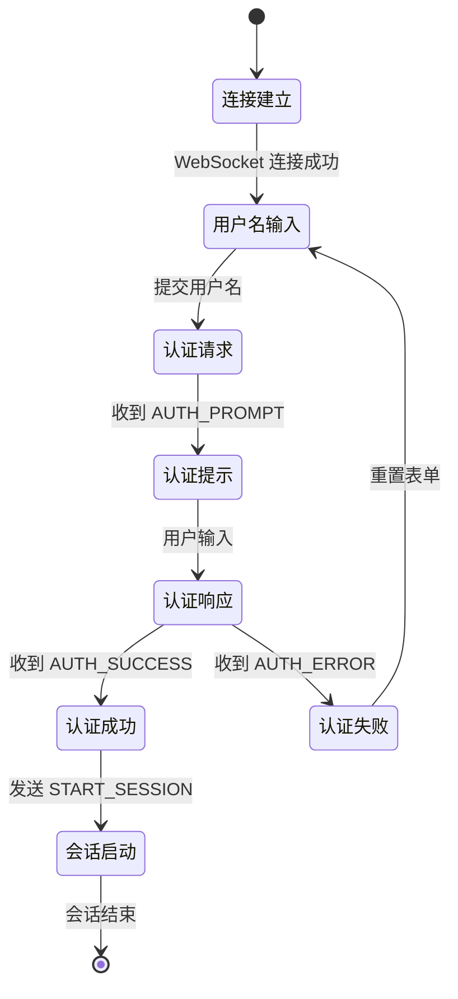

# PageOS-Greet 适配器设计文档

## 1. 概述

PageOS-Greet 是一个基于 Web 的登录管理器，使用 WebSocket 协议与后端通信。本文档详细说明如何适配自定义登录页面或 Scratch 项目以兼容 PageOS-Greet 系统。

现可考虑使用 [PageOS 环境扩展](https://github.com/swaybien/pageos-extension) 来实现模式判断；
用 [PageOS 登录管理器扩展](https://github.com/swaybien/pageos-extension/blob/master/src/pageos-login-manager.js) 实现接口适配和图形显示。

## 2. 登录流程



## 3. 适配要求

### 3.1 模式判断

在页面初始化时需判断当前是否处于登录模式：

```javascript
if (
  (window.location.hostname === "127.0.0.1" ||
    window.location.hostname === "localhost") &&
  window.location.port === "12801"
) {
  // 进入登录模式
}
```

可使用 [PageOS 环境扩展](https://github.com/swaybien/pageos-extension/blob/master/src/pageos-env-extension.js) 实现。

### 3.2 接口适配

必须实现以下核心功能组件：

- 用户名输入框
- 密码输入框（当需要时。也可与用户名输入框共用）
- 状态显示区域
- 错误提示区域
- 高级选项区域（可选）

## 4. WebSocket 通信协议

### 4.1 连接建立

```javascript
const ws = new WebSocket(`ws://${window.location.host}/ws`);
```

### 4.2 消息类型

#### 客户端发送消息：

1. 认证请求

```json
{
  "type": "AUTH_REQUEST",
  "username": "用户名"
}
```

2. 认证响应

```json
{
  "type": "AUTH_RESPONSE",
  "response": "用户输入"
}
```

#### 服务端发送消息：

1. 认证提示

```json
{
  "type": "AUTH_PROMPT",
  "message_type": "SECRET|VISIBLE|INFO|ERROR",
  "message": "提示信息"
}
```

2. 认证成功

```json
{
  "type": "AUTH_SUCCESS"
}
```

3. 认证失败

```json
{
  "type": "AUTH_ERROR",
  "reason": "错误原因"
}
```

## 5. 界面要求

### 5.1 基本元素

- 包含 `.auth-container` 容器
- 包含 `.loading` 加载状态显示
- 包含 `.interface` 交互区域
- 包含 `.log` 日志区域（可选但推荐）

### 5.2 状态管理

需实现以下状态函数：

```javascript
function showLoading(message) {}
function hideLoading() {}
function logMessage(msg, type) {}
function addPrompt(text, type) {}
function clearPrompt() {}
```

## 6. 会话启动参数

需提供以下输入项：

```html
<input id="session-env" type="text" placeholder="环境变量" />
<input
  id="session-cmd"
  type="text"
  placeholder="启动命令"
  value="%SESSION_COMMAND%"
/>
```

> `%SESSION_COMMAND%` 会在页面加载时被 pageos-greet 替换为实际启动命令。

## 7. 完整适配示例

参考 [login.html](login.html) 实现完整的登录流程处理，包括：

1. WebSocket 连接管理
2. 认证状态机处理
3. 错误处理和日志记录
4. 会话启动参数处理

## 8. 测试建议

1. 使用不同用户名和密码组合测试
2. 测试网络中断后的恢复能力
3. 验证会话启动参数的正确传递
4. 检查错误消息的显示效果
