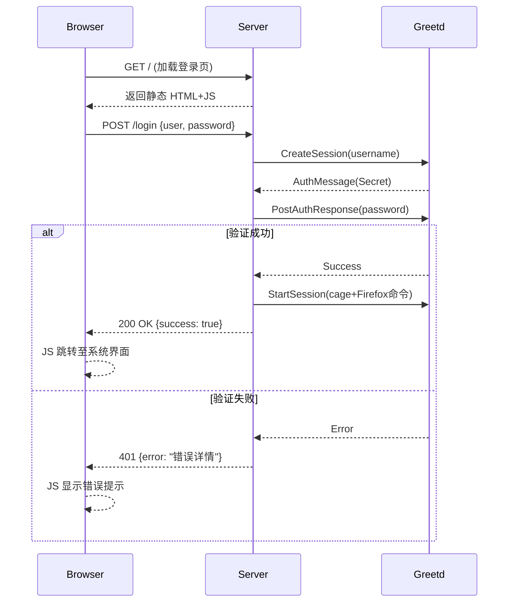

# PageOS Greet 设计文档

## 架构设计



## 核心组件

1. **HTTP服务器**
   - 使用 warp 框架
   - 路由:
     - GET / → 返回登录页HTML
     - POST /login → 处理登录请求
   - 错误响应格式: `{"error": "message"}`

2. **登录页面**

   ```html
   <!-- 内置默认HTML -->
   <!DOCTYPE html>
   <html>
   <head>
     <title>PageOS 登录</title>
     <script>
       async function login() {
         const res = await fetch('/login', {
           method: 'POST',
           headers: {'Content-Type': 'application/json'},
           body: JSON.stringify({
             user: document.getElementById('user').value,
             password: document.getElementById('password').value
           })
         });
         if(res.ok) {
           window.location.href = '/system';
         } else {
           const err = await res.json();
           document.getElementById('error').innerText = err.error;
         }
       }
     </script>
   </head>
   <body>
     <form onsubmit="event.preventDefault();login()">
       <input id="user" placeholder="用户名">
       <input id="password" type="password" placeholder="密码">
       <input id="session" placeholder="{session_command}">
       <button type="submit">登录</button>
     </form>
     <div id="error" style="color:red"></div>
   </body>
   </html>
   ```

3. **Greetd IPC 集成**
   - 复用 agreety 的 IPC 通信逻辑
   - 主要流程:
     1. CreateSession
     2. 处理 AuthMessage
     3. StartSession

## 配置参数

| 参数 | 描述 | 默认值 |
|------|------|--------|
| --port | HTTP 服务端口 | 12800 |
| --page | 自定义 HTML 路径 | 内置 HTML |
| --launch-command | 启动命令 | cage+Firefox |

## 依赖项

以下仅为示例。实际应使用 `cargo add` 添加依赖项。

```toml
[dependencies]
warp = "0.3"
tokio = { version = "1.0", features = ["full"] }
greetd_ipc = "0.9"
serde = { version = "1.0", features = ["derive"] }
serde_json = "1.0"
```
