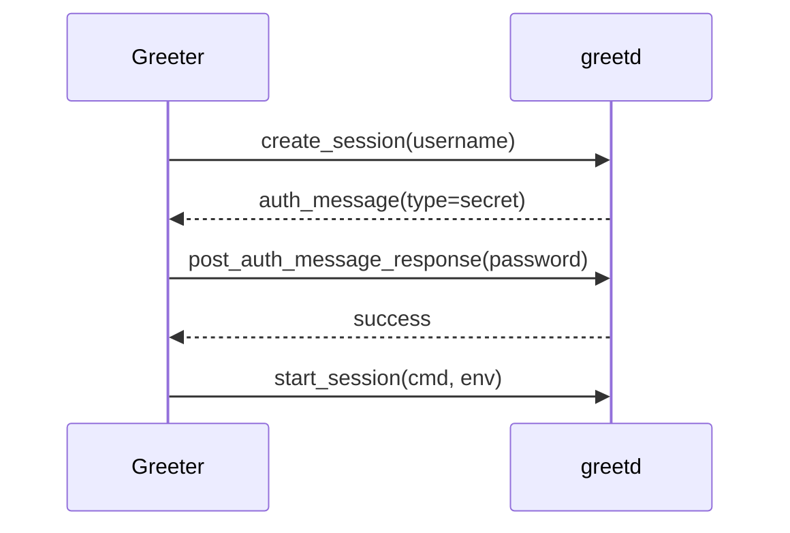

# pageos-greet 设计文档

## 1. 需求分析

- 实现符合 greetd-ipc(7) 协议的独立 greeter
- 支持网页登录界面服务（内置+自定义）
- 与 pageos-core 无缝集成
- 最小化依赖原则

## 2. 协议适配方案

### IPC 通信模块

```rust
// UNIX socket通信基础结构
struct IpcConnection {
    socket_path: PathBuf,
    stream: UnixStream,
}

impl IpcConnection {
    fn new() -> Result<Self> {
        let path = env::var("GREETD_SOCK")?;
        let stream = UnixStream::connect(path)?;
        Ok(Self { socket_path, stream })
    }

    fn send_message(&mut self, msg: &IpcMessage) -> Result<()> {
        let json = serde_json::to_string(msg)?;
        let len = json.len() as u32;
        self.stream.write_all(&len.to_ne_bytes())?;
        self.stream.write_all(json.as_bytes())?;
        Ok(())
    }
}
```

### 消息处理流程

1. `create_session` 创建会话
2. 处理`auth_message`认证消息
3. `post_auth_message_response`提交认证响应
4. `start_session`启动用户会话

## 3. 技术选型

| 组件       | 技术方案                   | 理由                                            |
| ---------- | -------------------------- | ----------------------------------------------- |
| 异步运行时 | tokio                      | 高性能异步 I/O，被 tuigreet 等主流 greeter 采用 |
| Web 服务器 | warp                       | 简单易用，支持异步，轻量级                      |
| IPC 协议   | greetd_ipc crate           | 官方维护，直接支持 greetd-ipc 协议              |
| 日志系统   | tracing + tracing-appender | 结构化日志，支持异步写入文件                    |
| 国际化     | i18n-embed                 | 支持多语言界面                                  |
| 配置解析   | config-rs                  | 支持多种格式的配置文件                          |

## 4. 依赖管理

### 核心依赖 (Cargo.toml)

```toml
[dependencies]
greetd_ipc = { version = "0.10", features = ["tokio-codec"] }
tokio = { version = "1.0", features = ["full"] }
warp = "0.3"
tracing = "0.1"
tracing-appender = "0.2"
tracing-subscriber = "0.3"
serde = { version = "1.0", features = ["derive"] }
config = "0.13"
i18n-embed = { version = "0.14", features = ["desktop-requester"] }
```

## 5. 模块设计

1. `ipc_handler` - IPC 协议实现
2. `auth_service` - 认证管理
3. `web_ui` - 网页服务器
4. `session_manager` - 会话控制

### 认证流程



## 6. 与 pageos-core 集成

通过`--launch-command`参数启动核心服务：

```sh
pageos-greet --launch-command "pageos-core --session-start"
```

## 7. 下一步计划

1. 实现基于 greetd_ipc crate 的 IPC 通信模块
2. 开发网页认证界面（内置基础 HTML/CSS）
3. 集成 PAM 认证后端
4. 实现会话包装机制（类似 tuigreet 的 session_wrapper）
5. 添加国际化支持
