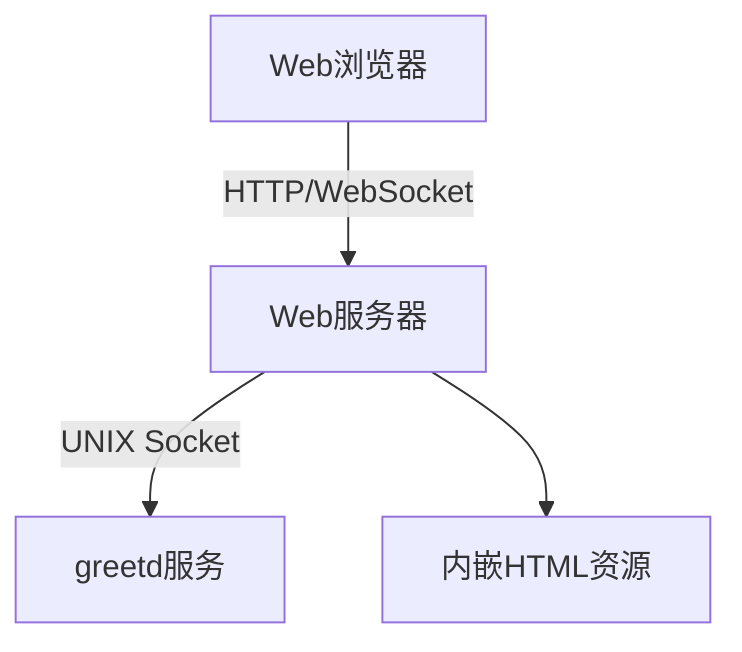
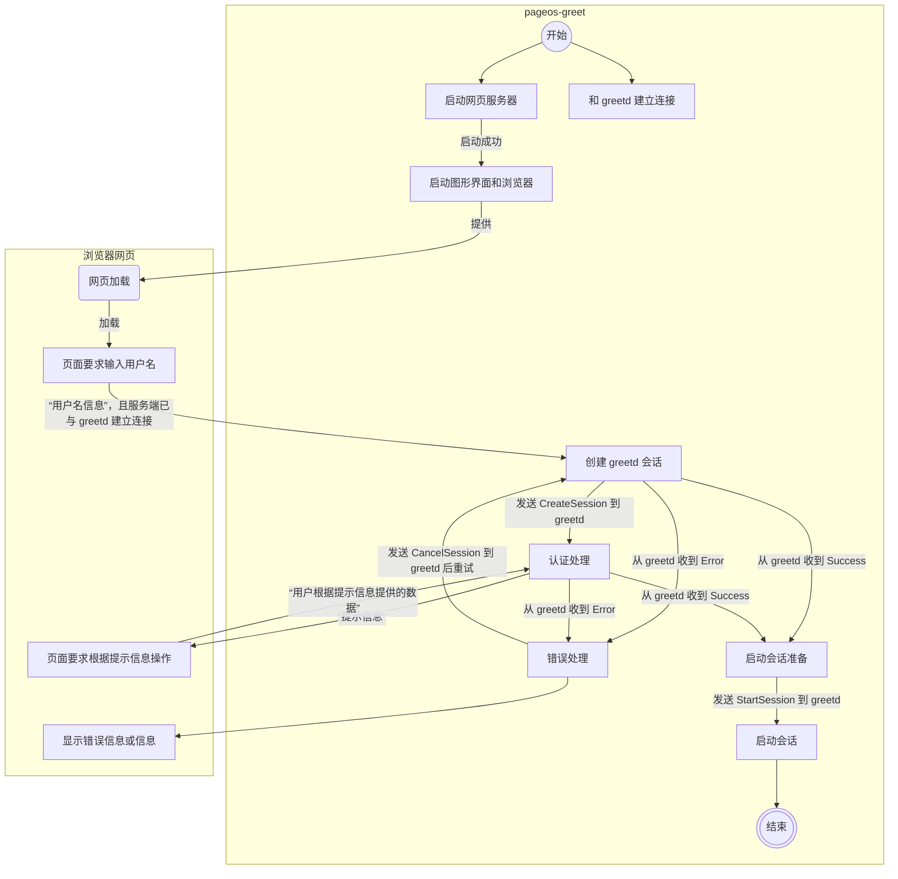

# 网页 Greeter 实现设计

## 1. 架构设计



## 2. 状态机流程图



## 3. Web 服务器实现

### 核心组件

- HTTP 服务器 (axum/warp)
- WebSocket 连接管理
- greetd IPC 客户端
- 会话状态机

### 端口配置

- 默认监听: 12801
- 可配置绑定地址

## 4. TODO API 设计

服务端返回当前认证状态:

```json
{
  "type": "Visible|Secret|Info|Error",
  "message": "提示信息"
}
```

> 因为 greetd 具体要获取信息未知，所以将 greetd 提供的提示（message）显示给用户，
> 让用户根据提示输入数据（用户名、密码、字符密钥等）。

浏览器网页提交用户响应:

```json
{
  "response": "用户输入"
}
```

## 5. 前端实现方案

### 内嵌 HTML

```rust
const INDEX_HTML: &str = r#"
<!DOCTYPE html>
<html>
  <head>
    <title>PageOS Greeter</title>
    <script>
      // WebSocket 客户端代码
    </script>
  </head>
  <body>
    <!-- 登录表单 -->
  </body>
</html>
"#;
```

### 交互流程

1. 页面加载后连接 WebSocket
2. 显示当前状态信息
3. 根据状态类型显示相应输入控件
4. 提交用户输入到接口

## 6. 与现有代码的集成

### 修改点

1. 将 main.rs 拆分为:

   - server.rs (Web 服务器)
   - ipc.rs (greetd 通信)
   - state.rs (会话状态机)

2. 共享核心逻辑:

```rust
async fn handle_auth_message(
    msg: AuthMessage
) -> Result<Response, Error> {
    // 复用现有认证处理逻辑
}
```

## 7. 安全考虑

- 仅允许本地访问(127.0.0.1)
- CSRF 保护
- 输入验证
- 会话超时
