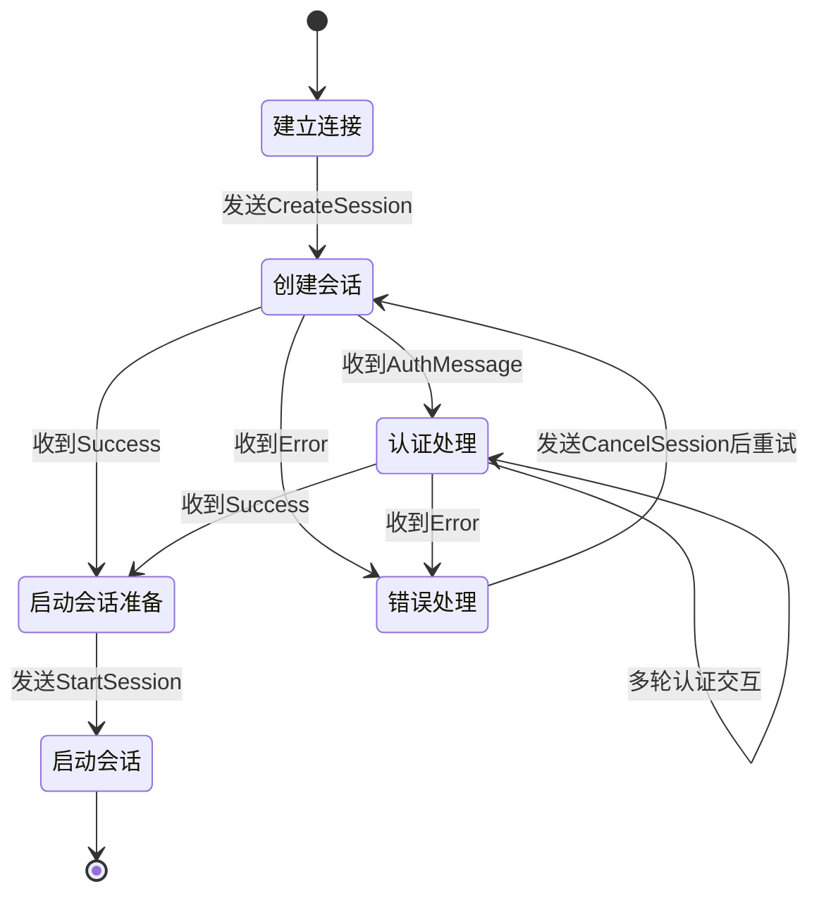

# 终端 Greeter 实现设计

## 1. 状态机流程图



## 2. 核心数据结构

### IPC 消息枚举

```rust
#[derive(Serialize, Deserialize)]
#[serde(tag = "type")]
enum IpcMessage {
    CreateSession { username: String },
    AuthMessage {
        auth_message_type: AuthType,
        auth_message: String
    },
    PostAuthMessageResponse { response: String },
    StartSession { cmd: Vec<String>, env: Vec<String> },
    CancelSession,
    Success,
    Error { description: String }
}
```

### Greeter 状态控制

```rust
struct GreeterState {
    retry_count: u8,
    username: String,
    starting_session: bool, // 会话启动标志
}

// 状态通过控制流实现
```

## 3. 终端交互逻辑

### 主控制循环

```rust
fn main_loop() -> Result<()> {
    let mut state = GreeterState::new();

    while !state.is_terminal() {
        match current_phase {
            Phase::Initial => connect_to_greetd(),
            Phase::SessionCreation => send_create_session(),
            Phase::Authentication => handle_auth_message(),
            Phase::SessionStart => send_start_session(),
            Phase::Error => handle_error_retry(),
        }
    }
    Ok(())
}
```

## 4. 错误处理策略

### 统一错误处理

```rust
fn handle_error(state: &mut GreeterState, error: &io::Error) {
    match error.kind() {
        io::ErrorKind::PermissionDenied => {
            // 认证错误立即重试
            state.retry_count += 1;
        }
        io::ErrorKind::ConnectionRefused => {
            // 连接错误使用指数退避
            let delay = RETRY_DELAY * 2u64.pow(state.retry_count as u32);
            sleep(Duration::from_secs(delay));
            state.retry_count += 1;
        }
        _ => {
            // 其他错误终止会话
            state.terminal = true;
        }
    }
}
```

## 5. 新增功能说明

### 指数退避重试机制

```rust
// 网络错误重试策略
for retry in 0..MAX_RETRIES {
    match connect() {
        Ok(stream) => break,
        Err(_) => {
            let delay = RETRY_DELAY * 2u64.pow(retry as u32);
            sleep(Duration::from_secs(delay));
        }
    }
}
```

### 环境变量过滤

```rust
// 安全环境变量白名单
let safe_env = vec!["LANG", "PATH", "DISPLAY", "XAUTHORITY", "WAYLAND_DISPLAY"];
let env: Vec<String> = env::vars()
    .filter(|(k, _)| safe_env.contains(&k.as_str()))
    .map(|(k, v)| format!("{k}={v}"))
    .collect();
```

## 6. 会话启动优化

- 使用 `starting_session` 标志替代 `ReadyToStart` 状态
- 环境变量自动继承当前会话安全值
- VT 号码自动检测（通过 `XDG_VTNR`）
