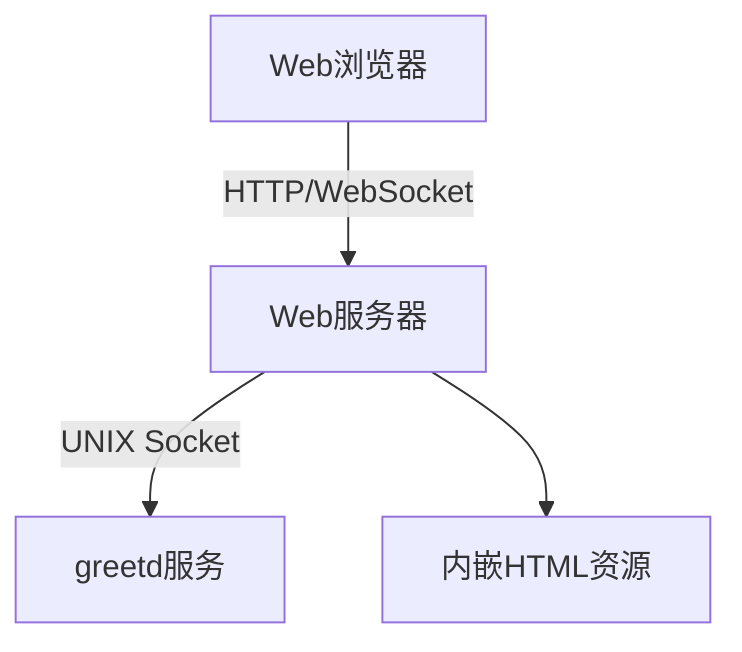
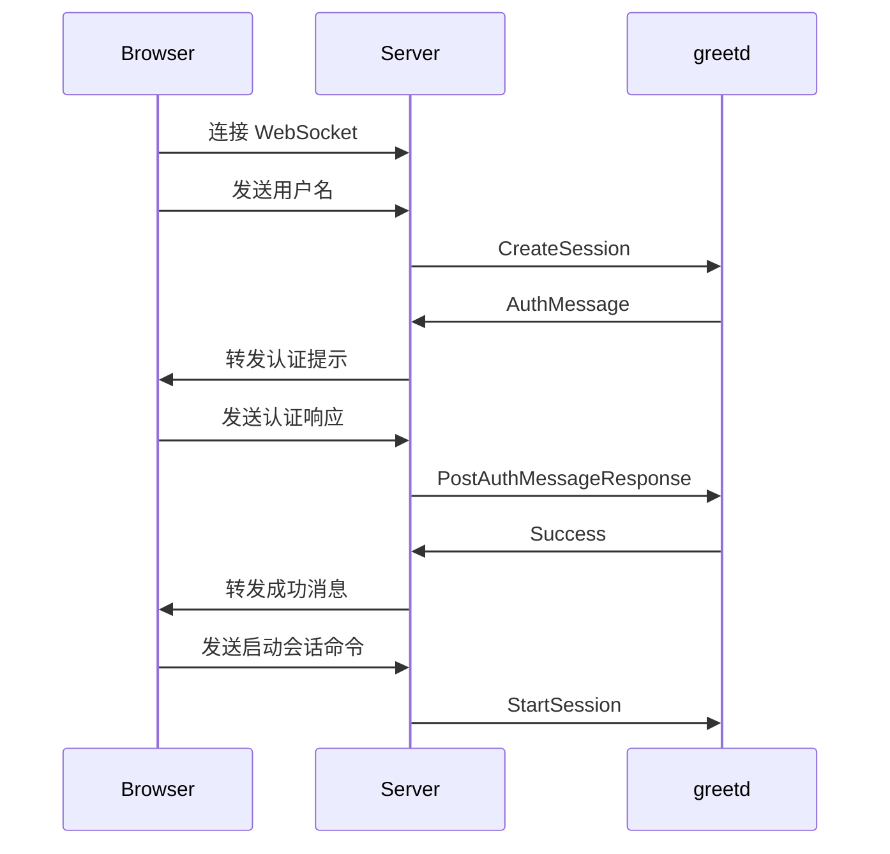

# 网页 Greeter 实现设计

## 1. 架构设计



## 2. 职责划分

### Rust 部分职责

- 启动 HTTP 服务器 (使用 axum)
- 处理 WebSocket 连接
- 转发 greetd-ipc 协议消息
- 会话生命周期管理
- 参数和环境变量处理

### HTML/JS 部分职责

- 用户界面展示
- 登录流程状态机
- 处理用户输入和服务器响应
- 错误处理和重试逻辑

## 3. WebSocket 接口设计

### 消息格式

```rust
// WebSocket 消息格式
enum WsMessage {
    // 从客户端到服务器
    AuthRequest { username: String },
    AuthResponse { response: String },
    StartSession { cmd: Vec<String>, env: Vec<String> },

    // 从服务器到客户端
    AuthMessage { message: String, message_type: String },
    AuthSuccess,
    AuthError { reason: String },
}
```

### 协议映射表

| WebSocket 消息类型 | IPC 请求类型            | 字段映射             |
| ------------------ | ----------------------- | -------------------- |
| AUTH_REQUEST       | CreateSession           | username ←→ username |
| AUTH_RESPONSE      | PostAuthMessageResponse | response ←→ response |
| START_SESSION      | StartSession            | cmd/env ←→ cmd/env   |

### 消息转换层

```rust
// WebSocket消息 -> greetd IPC请求
fn ws_to_ipc(msg: WsMessage) -> Result<Request, Error> {
    match msg {
        WsMessage::AuthRequest { username } =>
            Ok(Request::CreateSession { username }),
        WsMessage::AuthResponse { response } =>
            Ok(Request::PostAuthMessageResponse { response: Some(response) }),
        WsMessage::StartSession { cmd, env } =>
            Ok(Request::StartSession { cmd, env }),
        _ => Err(Error::InvalidMessage)
    }
}

// greetd IPC响应 -> WebSocket消息
fn ipc_to_ws(resp: Response) -> WsMessage {
    match resp {
        Response::AuthMessage { auth_message_type, auth_message } =>
            WsMessage::AuthMessage {
                message_type: auth_message_type.to_string(),
                message: auth_message
            },
        Response::Success => WsMessage::AuthSuccess,
        Response::Error { error_type, description } =>
            WsMessage::AuthError { reason: description },
    }
}
```

## 4. 交互流程图



## 5. 内嵌 HTML 实现方案

### 状态机实现 (HTML/JS)

```javascript
// 登录流程状态机
class AuthStateMachine {
  constructor(ws) {
    this.ws = ws;
    this.state = "INITIAL";
  }

  handleMessage(msg) {
    switch (this.state) {
      case "INITIAL":
        if (msg.type === "AUTH_PROMPT") {
          this.state = "AUTHENTICATING";
          showPrompt(msg);
        }
        break;
      case "AUTHENTICATING":
        if (msg.type === "AUTH_SUCCESS") {
          this.state = "READY";
          showSuccess();
        } else if (msg.type === "AUTH_ERROR") {
          this.state = "ERROR";
          showError(msg.reason);
        }
        break;
      // 其他状态处理...
    }
  }
}
```

### 基本 HTML 结构

```html
<!DOCTYPE html>
<html>
  <head>
    <title>PageOS Greeter</title>
    <script>
      // WebSocket客户端和状态机实现
      const ws = new WebSocket("ws://localhost:12801");
      const stateMachine = new AuthStateMachine(ws);

      ws.onmessage = (event) => {
        const msg = JSON.parse(event.data);
        stateMachine.handleMessage(msg);
      };
    </script>
  </head>
  <body>
    <div id="auth-container">
      <div id="prompt"></div>
      <input id="response-input" type="text" />
      <button id="submit-btn">提交</button>
      <div id="status-log"></div>
    </div>
  </body>
</html>
```

## 6. 代码组织

### 文件结构

- `server.rs` - Web 服务器和路由
- `ipc.rs` - greetd IPC 通信
- `handlers.rs` - WebSocket 消息处理
- `main.rs` - 程序入口和配置

### Rust 端简化示例

```rust
async fn handle_websocket(ws: WebSocket, ipc_conn: UnixStream) {
    // 简单的消息转发循环
    while let Some(msg) = ws.next().await {
        let ipc_msg = ws_to_ipc(msg)?;
        ipc_msg.write_to(&mut ipc_conn).await?;
        let resp = Response::read_from(&mut ipc_conn).await?;
        let ws_msg = ipc_to_ws(resp);
        ws.send(ws_msg).await?;
    }
}
```

## 7. 参数处理

- 使用 clap 处理命令行参数：

```rust
#[derive(Parser)]
struct Args {
    #[arg(short, long, default_value = "12801")]
    port: u16,

    #[arg(short, long)]
    session_command: Option<String>,
}
```

## 8. 安全考虑

- 仅允许本地访问(127.0.0.1)
- CSRF 保护
- 会话超时
- 环境变量过滤（仅传递安全变量）
