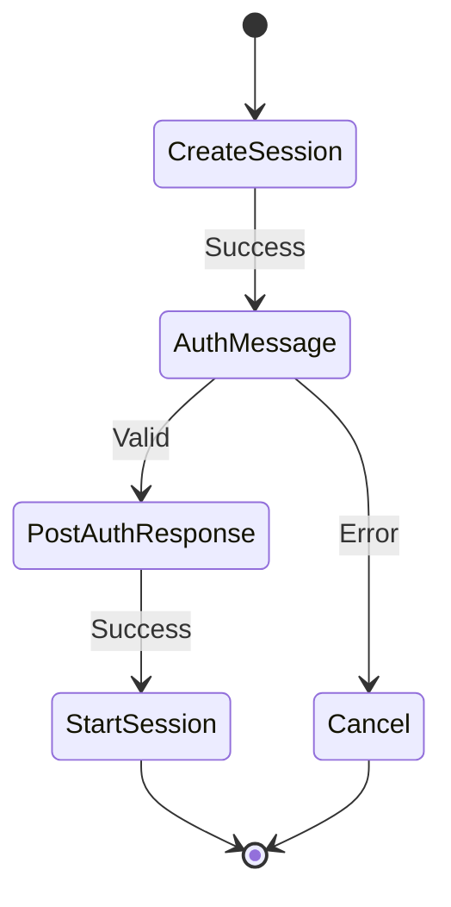
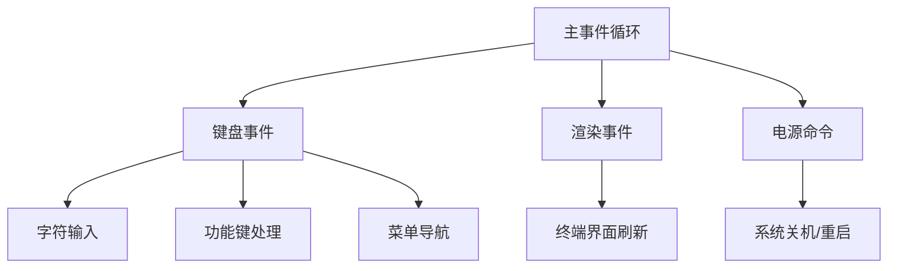
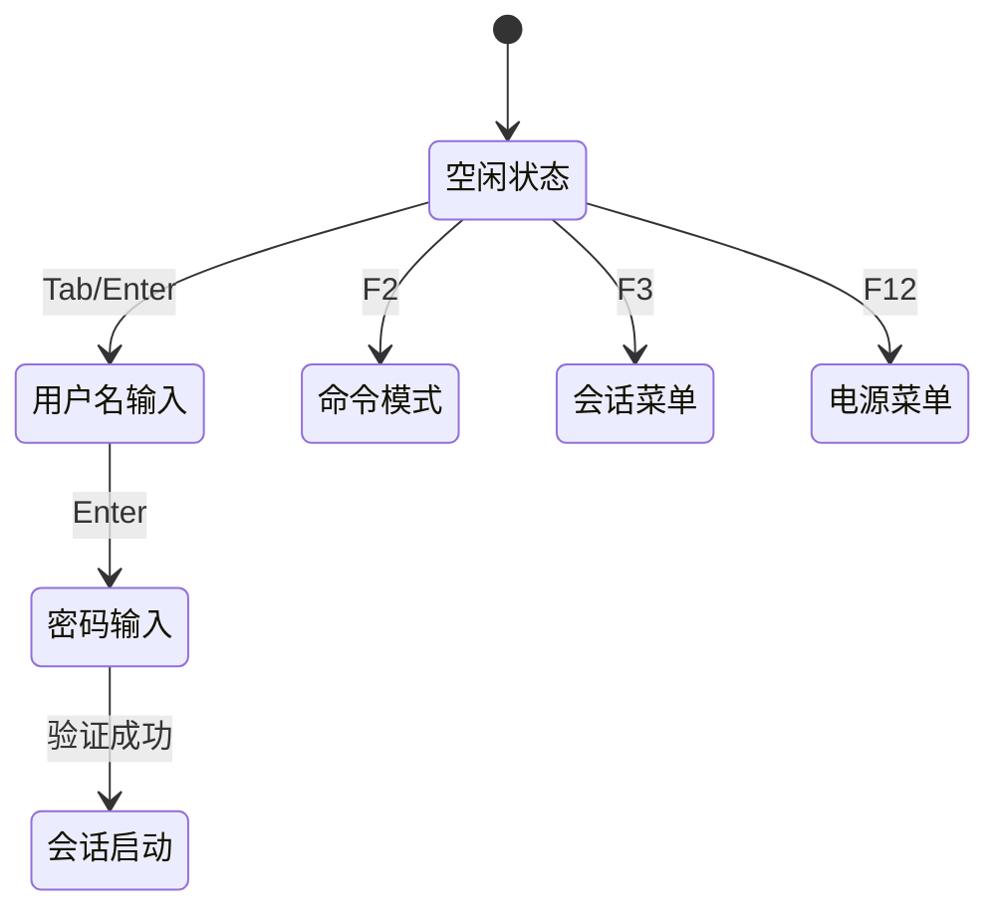
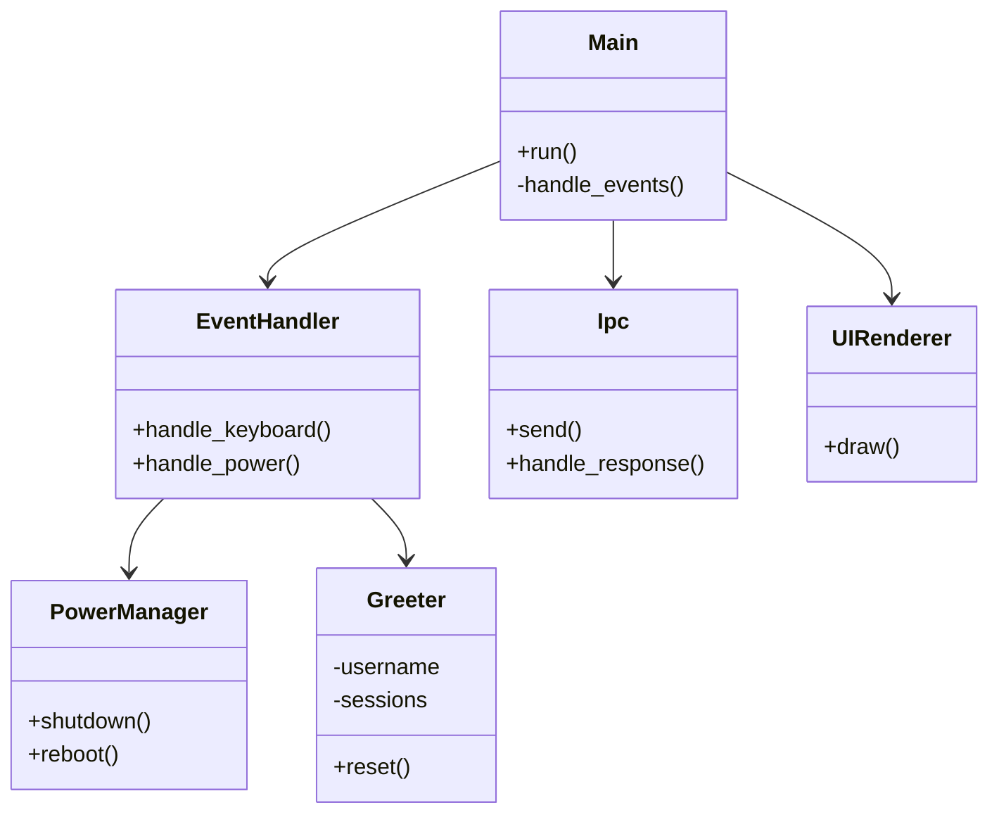
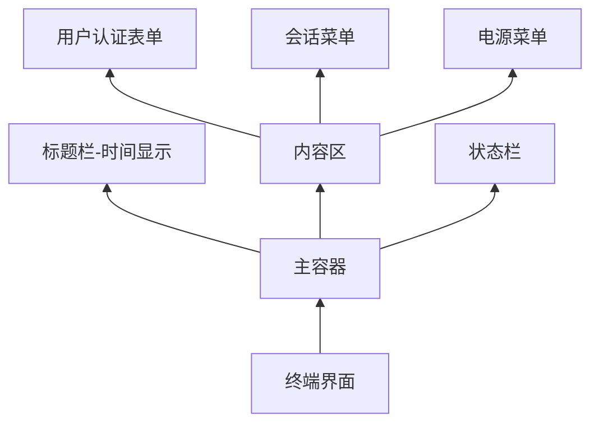

# tuigreet 技术实现解析

## 一、协议适配机制

### 1.1 IPC 协议实现



关键实现 [`参考/tuigreet/src/ipc.rs`]:

```rust
async fn parse_response(greeter: &mut Greeter, response: Response) {
    match response {
        Response::AuthMessage { auth_message_type, .. } => {
            greeter.mode = match auth_message_type {
                AuthMessageType::Secret => Mode::Password,
                // 其他认证消息处理
            }
        }
        Response::Success => {
            // 启动会话逻辑
            self.send(Request::StartSession { ... }).await;
        }
    }
}
```

### 1.2 事件处理机制



核心循环 [`参考/tuigreet/src/event.rs`]:

```rust
loop {
    let event = stream.next().fuse();
    tokio::select! {
        event = event => { /* 处理键盘事件 */ },
        _ = render => { /* 定时渲染界面 */ },
    }
}
```

### 1.3 消息格式

遵循 greetd-ipc(7) 规范：

- 消息头：32 位小端字节序长度
- JSON 载荷格式：
  ```json
  {
    "type": "create_session",
    "username": "user"
  }
  ```

## 二、系统架构设计

### 2.1 键盘处理系统



核心逻辑 [`参考/tuigreet/src/keyboard.rs`]:

```rust
async fn handle(greeter: Arc<RwLock<Greeter>>, input: KeyEvent) {
    match input {
        // 功能键处理
        KeyEvent { code: KeyCode::F(i), .. } if i == greeter.kb_command => {
            greeter.mode = Mode::Command; // 进入命令编辑模式
        }
        // 字符输入
        KeyEvent { code: KeyCode::Char(c), .. } => insert_key(&mut greeter, c).await,
    }
}
```

### 2.2 模块结构



## 三、依赖分析

### 3.1 关键依赖库

| 依赖项     | 版本 | 用途             |
| ---------- | ---- | ---------------- |
| greetd_ipc | 0.10 | IPC 协议编解码   |
| ratatui    | 0.27 | 终端用户界面渲染 |
| tokio      | 1.2  | 异步运行时       |
| zeroize    | 1.3  | 敏感数据擦除     |

### 3.2 安全机制

密码处理实现 [`参考/tuigreet/src/greeter.rs`]:

```rust
impl Greeter {
    fn scrub(&mut self) {
        self.buffer.zeroize(); // 安全擦除内存
        self.username.zeroize();
    }
}
```

## 四、配置系统

### 4.1 会话管理

```rust
// 会话缓存逻辑
if greeter.remember_user_session {
    write_last_user_session(&username, session_path);
    delete_last_user_command(&username);
}
```

### 4.2 电源管理系统

支持两种电源操作：

1. 关机 (`PowerOption::Shutdown`)
2. 重启 (`PowerOption::Reboot`)

实现原理 [`参考/tuigreet/src/power.rs`]:

```rust
pub async fn power(greeter: &mut Greeter, option: PowerOption) {
    let command = match option {
        PowerOption::Shutdown => {
            // 构造关机命令
            Command::new("shutdown").arg("-h").arg("now")
        }
        PowerOption::Reboot => {
            // 构造重启命令
            Command::new("shutdown").arg("-r").arg("now")
        }
    };

    // 发送电源命令事件
    sender.send(Event::PowerCommand(command)).await;
}
```

## 五、UI 渲染系统

### 5.1 界面分层架构



渲染流程 [`参考/tuigreet/src/ui/mod.rs`]:

```rust
pub async fn draw(greeter: Arc<RwLock<Greeter>>, terminal: &mut Terminal) {
    terminal.draw(|f| {
        // 1. 绘制标题栏（时间）
        f.render_widget(time, chunks[TITLEBAR_INDEX]);

        // 2. 绘制状态栏
        f.render_widget(status_left, status_chunks[STATUSBAR_LEFT_INDEX]);

        // 3. 根据当前模式绘制内容
        match greeter.mode {
            Mode::Command => self::command::draw(),
            Mode::Sessions => greeter.sessions.draw(),
            // ...其他模式
        }
    });
}
```

### 5.2 认证表单渲染

密码显示支持两种模式 [`参考/tuigreet/src/ui/prompt.rs`]:

```rust
let value = match (greeter.asking_for_secret, &greeter.secret_display) {
    (true, SecretDisplay::Character(pool)) => {
        // 字符掩码模式
        pool.repeat(greeter.buffer.chars().count())
    }
    _ => {
        // 明文显示模式
        greeter.buffer.clone()
    }
};
```

## 总结

tuigreet 采用模块化设计，通过事件驱动架构处理用户交互：

1. IPC 模块实现与 greetd 的协议通信
2. 键盘处理系统管理用户输入流
3. 电源管理封装系统关机/重启操作
4. UI 渲染层提供终端图形界面
5. 配置系统支持会话记忆和主题定制

完整实现遵循 Linux 控制台应用最佳实践，提供安全可靠的登录管理体验。
